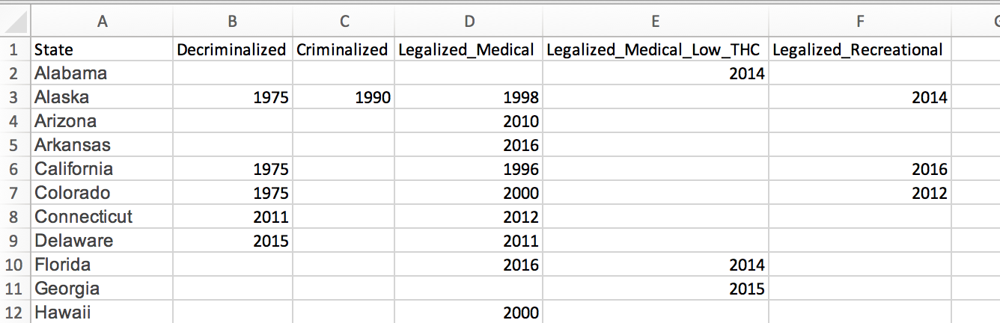

```{r setup, echo=FALSE}
knitr::opts_chunk$set(fig.width=8, fig.height=6, fig.align = 'center',
                      error=FALSE, warning=FALSE, message=FALSE, dpi=300)

# Inelegant solution to font dependency issues
options(device = function(file, width, height) {
  png(tempfile(), width = width, height = height)
})

```

Today is April 20, 2019. As stoners everywhere celebrate the occasion, I thought I'd turn to creating maps.

As the number of legal marijuana states and medical marijuana states seems to have grown considerably in recent years, I got thinking: what has the history been of legalization and how has it grown over time?

In the graph below, I show legal marijuana states, medical marijuana states, and illegal marijuana states over time. Note that for medical marijuana states, there are two categories: broadly legal for medical purposes, and low-THC marijuana legal for medical purposes. Without further ado, I present the map:


Read on if you're interested in learning how to create this map yourself in R!

## Gathering the data

I sourced the data for legal marijuana states and medical marijuana states from the [Timeline of cannabis laws in the United States](https://en.wikipedia.org/wiki/Timeline_of_cannabis_laws_in_the_United_States) article on Wikipedia. 

```{r}
library(albersusa) # devtools::install_github("hrbrmstr/albersusa")
library(animation)
library(ggalt)
library(hrbrthemes)
library(maps)
library(tidyverse)

# Set up base map theme for ggplot
map_theme <- theme(axis.line = element_blank(), 
        axis.text = element_blank(), 
        axis.ticks = element_blank(), 
        panel.background = element_blank(), 
        panel.border = element_blank(), 
        panel.grid.major = element_blank(), 
        panel.grid.minor = element_blank(), 
        plot.background = element_blank(),
        legend.position = 'top')

timeline <- read_csv('~/Desktop/Marijuana_Legalization.csv')
```

Above I load in the various packages we'll be using for this analysis. I also create a blank map theme that will remove a lot of things like axis gridlines and text that we don't want on our final map.

Then, I load in the legal marijuana states data I gathered from the Wikipedia article above. I had to do some manual processing to convert the text in that article to a workable file that had dates of different legalization statuses by state. The file I ended up putting together looked like this:

<center>
{width=600px}
</center>

In order to create the animated graph, we need to reformat the input data a bit. Ultimately, we want a dataset organized with three columns:

* `Year` 
* `State`
* `Status`

There should be one status entry for each combination of `Year` and `State`, giving the legal marijuana status for that state in that particular year.

While we don't need it for this map, I'm also going to include a `Criminalized` column to indicate whether marijuana had been decriminalized in a particular year in a state. The processing to get the data in this format all happens in the section below.

For each state, we read in the data to determine which year, if any, marijuana became medicinally legal, recreationally legal, or medicinally legal with low-THC content. This lets us categorize each state-year combination into one of four categories:

`Illegal`: All forms of marijuana consumption are illegal
`Low-THC Medicinally Legal`: Low-THC varieties of marijuana are legal for medicinal use
`Medicinally Legal`: Marijuana is legal for medicinal use
`Legal`: Marijuana is legal for recreational use

```{r}
legalized <- data.frame()
for(state in timeline$State) {
    current_state <- filter(timeline, State == state)
    
    decrim_year <- current_state$Decriminalized
    crim_year <- current_state$Criminalized
    med_year <- current_state$Legalized_Medical
    med_low_year <- current_state$Legalized_Medical_Low_THC
    legal_year <- current_state$Legalized_Recreational
    
    status = 'Illegal'
    criminalized = TRUE
    for(year in 1960:2019) {
        if(!is.na(decrim_year) & year == decrim_year) {
            criminalized = FALSE
        }
        
        if(!is.na(crim_year) & year == crim_year) {
            criminalized = TRUE
        }
        
        if(!is.na(med_year) & year == med_year) {
            status = 'Legal for Medical Use'
        }
        
        if(!is.na(med_low_year) & year == med_low_year) {
            status = 'Legal for Medical Use, Low-THC Only'
        }
        
        if(!is.na(legal_year) & year == legal_year) {
            status = 'Legal'
        }
        
        current_status <- data.frame(State = state, 
                                     Year = year,
                                     Status = status,
                                     Criminalized = criminalized)
        
        legalized <- rbind(legalized, current_status)
    }
}
```

Great, so now we have the data that we'll need to create our ultimate graph of legal marijuana states. First, I'm going to create the graph for 2019 to make sure that I have the base formatting down. 

I start by loading in a shapefile for the United States that we'll use for graphing. I remove Washington D.C. which I didn't pull legalization data for initially, which causes issues with mapping.

Then I reorganize the legal status into a factor column, which lets us create explicit orders and color mappings below, something we'll need to create the final graph. 

I filter the legalization data to only include 2019, then merge the legalization data with the map shapefile to get the information we need for graphing. Finally, I produce the ultimate graph in ggplot! 

```{r map it}
us <- usa_composite()
us_map <- fortify(us, region="name") %>% filter(id != 'District of Columbia')

legalized$Status <- factor(legalized$Status, 
                           levels = c('Illegal', 
                                      'Legal for Medical Use, Low-THC Only',
                                      'Legal for Medical Use',
                                      'Legal'))

legalized_2019 <- filter(legalized, Year == 2019)

legalized_2019_map <- merge(us_map, legalized_2019, by.x = "id", by.y = "State", all = T) %>%
    arrange(order)

ggplot(legalized_2019_map) +
    geom_polygon(aes(fill = Status, x = long, y = lat, group = group), color = 'white') +
    coord_proj(us_laea_proj) +
    scale_fill_manual(values = c('#E9E9E9', '#105927', '#349941', '#61DE58'),
                      name = '', limits = levels(legalized$Status)) +
    theme_ipsum(base_size = 10) +
    map_theme +
    labs(title = paste0('Legal Status of Marijuana in in ', year),
         subtitle = '',
         x = 'michaeltoth.me / @michael_toth', y = '')
```

A quick comparison of the above map to other maps I found shows we're capturing the legal statuses correctly, so we're all set. Now, let's get to animating so we can create the complete graph from above!

```{r map it_animated}
legalized_map <- merge(us_map, legalized, by.x = "id", by.y = "State", all = T) %>%
    arrange(order)

saveGIF({
  # Repeat 2019 6 times for a pause at the end of the animation
  for (year in c(1995:2019, rep(2019, 5))) {
      yearly_map <- filter(legalized_map, Year == year)

      p <- ggplot(yearly_map) +
           geom_polygon(aes(fill = Status, x = long, y = lat, group = group), color = 'white') +
           coord_proj(us_laea_proj) +
           scale_fill_manual(values = c('#E9E9E9', '#105927', '#349941', '#61DE58'),
                             name = '', limits = levels(legalized$Status)) +
           theme_ipsum(base_size = 24, plot_title_size = 36,
                       axis_title_size = 24) +
           map_theme +
           labs(title = paste0('Legal Status of Marijuana in ', year),
                x = 'michaeltoth.me / @michael_toth', y = '')
      
      print(p)
  }

}, movie.name = '~/dev/michaeltoth/content/figures/20190419_Marijuana_Legalization/map.gif', interval = 1, ani.width = 1400, ani.height = 1000)
```

Above I create the same map, except that I produce 1 map separately for each year from 1995 to 2019. I also repeat 2019 6 times in total to give the effect of pausing on the final frame.

To create this animation, I wrap the creation of the yearly maps in the saveGIF command, which will convert a series of images into a GIF. Then, I loop through the years 1995-2019 (repeating 2019 6 times), to create the animation!


------

Did you find this post interesting? I frequently write tutorials like this one to help you learn new skills and improve your data science. If you want to be notified of new tutorials, [sign up here!](http://eepurl.com/gmYioz)
