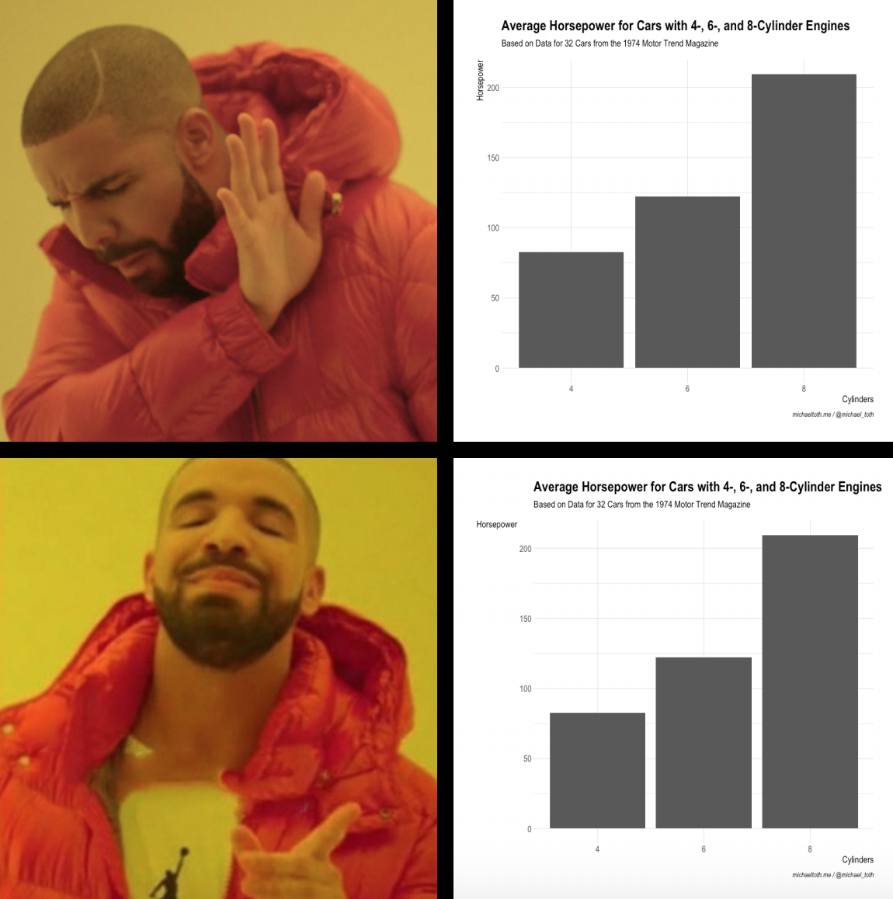

```{r setup, echo=FALSE}
knitr::opts_chunk$set(fig.width=8, fig.height=6, fig.align = 'center',
                      error=FALSE, warning=FALSE, message=FALSE, dpi=100)

# Inelegant solution to font dependency issues
options(device = function(file, width, height) {
  png(tempfile(), width = width, height = height)
})

```

There's something wonderful about a graph that communicates a point clearly. You know it when you see it. It's the kind of graph that makes you pause and say 'wow!'. 

There are all kinds of different graphs that fit this description, but they usually have a few things in common:

* Clarity: The message of the graph is clear
* Simplicity: Extraneous details are removed
* Visual appeal: The graph should be pleasing to look at

Of course, your graph also needs to be communicating something worthwhile. But I see so many graphs that ultimately fall short of their potential because they don't meet these three points above! 

I've been there myself. Some of my [earliest](https://michaeltoth.me/analyzing-historical-default-rates-of-lending-club-notes.html) [graphs](https://michaeltoth.me/plotting-the-evolution-of-the-us-treasuryyield-curve.html) in R fall short, in retrospect. But the key to improving is to keep learning new things and keep getting better over time.

It seems like many people learn how to create basic [bar charts](https://michaeltoth.me/detailed-guide-to-the-bar-chart-in-r-with-ggplot.html), [scatter plots](https://michaeltoth.me/a-detailed-guide-to-the-ggplot-scatter-plot-in-r.html), and [line graphs](https://michaeltoth.me/a-detailed-guide-to-plotting-line-graphs-in-r-using-ggplot-geom_line.html) in R, and then stop developing their skills further. But you shouldn't stop there! 

I don't think most people are doing this intentionally. In fact, I think most people simply don't know what's possible and what they should be aiming for. 

If the only graphs you've ever seen are basic examples from statistics textbooks or code documentation, how would you possibly know that you can do better? How would you know that you can create graphs that capture attention, drive action, or inspire awe? **You wouldn't**.

I want to teach you how to make graphs that get your point across with clarity, simplicity, and visual appeal. There are quick fixes you can make to your graphs **right now** that will get you much closer to making that a reality.

Today, I'm going to show you how you can use axis text rotation to greatly improve both the readability and visual appeal of your graphs. 

<center>
{width=600px}
</center>


Are you ready? Let's go!

## Creating a Base Graph to Work From

To start, let's load in the libraries we'll be using throughout this post: `tidyverse` (for graphing and data manipulation), and `hrbrthemes` (a useful package that I use to improve the styling of my graphs).

```{r load packages}
library(hrbrthemes)
library(tidyverse)
```

For this post, we'll be using the `mtcars` dataset to illustrate these graphing techniques. Here, I group the cars in that dataset by the number of cylinders in their engines (4, 6, or 8), and then calculate the average horsepower for each group.

```{r calculate_average}
# Calculate average horsepower for cars with 4-, 6-, and 8-cylinder engines
hp_by_cyl <- mtcars %>% group_by(cyl) %>%
    summarise(avg_hp = mean(hp))
```

Finally, I create a simple bar chart in `ggplot` to show this data. Let's review this code briefly, so we're all on the same page:

* The first two lines (`ggplot` and `geom_bar`) are what creates the base bar chart. 
* The next 5 lines use the `labs` function to assign labels to the graph. 
* The last line uses `theme_ipsum` from the `hrbrthemes` package to apply some nice styling to the graph.

```{r first_graph}
# Creating a base graph without formatting the axis text
g <- ggplot(hp_by_cyl) +
    geom_bar(aes(x = factor(cyl), y = avg_hp), stat = 'identity') + 
    labs(title = 'Average Horsepower for Cars with 4-, 6-, and 8-Cylinder Engines',
         subtitle = 'Based on Data for 32 Cars from the 1974 Motor Trend Magazine',
         x = 'Cylinders',
         y = 'Horsepower',
         caption = 'michaeltoth.me / @michael_toth') +
    theme_ipsum(axis_title_size = 12)

g
```

This graph is fine, for the most part. But I don't aim for fine, and you shouldn't either! 

I have a high attention to detail for graphing, and I want my graphs to be excellent. The easier I can make it for people to read and understand a graph, the better job I'll do of convincing them to move forward with a particular course of action. 

## Rotate Your Y-Axis Title To Improve Readability

There are several things we could do to improve this graph, but in this guide let's focus on rotating the y-axis label. This simple change will make your graph **so much better**. That way, people won't have to tilt their heads like me to understand what's going on in your graph:

<center>
{width=600px}
</center>

That's not a look you want. Luckily, it's super easy to rotate your axis title in `ggplot`! To do this, we'll modify some parameters using `ggplot`'s `theme` function, which can also be used to adjust all kinds of things in your graph like axis labels, gridlines, and text sizing. 

Here, we specifically want to adjust the y-axis, which we can do using the `axis.title.y` parameter. To adjust a text element, we use `element_text`. You can use `element_text` this to adjust things like font, color, and size. But here, we're interested in rotation, so we're going to use `angle`. Setting the `angle` to 0 will make the y-axis text horizontal. Take a look: 

```{r rotate_labels}
# Modifying the graph from before (stored as g), to make the text horizontal
g + theme(axis.title.y = element_text(angle = 0))
```

It's a minor change, but this graph is **far more readable** and **more visually appealing** than the graph we had before. That's what we're going for. Simplicity, clarity, and visual appeal.

## More on Text Rotation in `ggplot`

As we just saw, when you need to rotate text in `ggplot`, you can accomplish this by adjusting the `angle` within `element_text`. Here we did this to adjust the axis title, but this works the same way for any text that you want to rotate in ggplot.

The `angle` parameter can take any value between 0 and 360, corresponding to the angle of rotation from a horizontal baseline. To briefly illustrate how different angle values work in ggplot, take a look at the following graph, where I explore four different angle rotations:

```{r axis_rotations, fig.width = 10, fig.height = 7}
library(gridExtra)

# 0-Degree angle
g1 <- g + theme(axis.title.y = element_text(angle = 0)) + 
    labs(title = 'Y-Axis Title at 0 degrees', 
         subtitle = 'Using theme(axis.title.y = element_text(angle = 0))', 
         caption = '')

# 90-Degree angle
g2 <- g + theme(axis.title.y = element_text(angle = 90)) + 
    labs(title = 'Y-Axis Title at 90 degrees', 
         subtitle = 'Using theme(axis.title.y = element_text(angle = 90))', 
         caption = '')

# 180-Degree angle
g3 <- g + theme(axis.title.y = element_text(angle = 180)) + 
    labs(title = 'Y-Axis Title at 180 degrees', 
         subtitle = 'Using theme(axis.title.y = element_text(angle = 180))', 
         caption = '')

# 270-Degree angle
g4 <- g + theme(axis.title.y = element_text(angle = 270)) + 
    labs(title = 'Y-Axis Title at 270 degrees', 
         subtitle = 'theme(axis.title.y = element_text(angle = 270))')

# Add all graphs to a grid
grid.arrange(g1, g2, g3, g4, nrow = 2, ncol = 2)
```

You should now have a better understanding of how you can use axis title rotation to improve the readability and visual appeal of your graphs in `ggplot`! 

You really need to think about minor details like this, especially when you're going to be using a graph in a presentation or a report to a broader audience. Small details can really improve your graph, which in turn will make it easier for you to educate your audience, convince people of your conclusions, and drive change in your organization. 

-----

I will help you learn the specific skills you need to work more effectively, grow your income, and improve your career.

[Sign up here to receive my best tips](http://eepurl.com/gmYioz)
