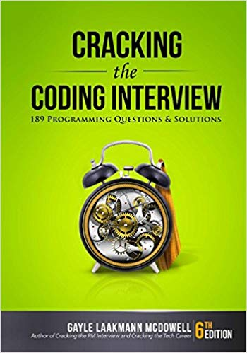

Title: Resources

## The Tools You Need to Take Your Data Science Learning and Career to the Next Level

My resources section is a curated list of the tools and websites I strongly recommend for learning analytics and building a data science career. I have tested every recommendation on this page. Many of the resources listed here have been and continue to be crucial to my growth as a data scientist. 

Before digging into these awesome resources, an important disclosure:

Some of the links below are affiliate links, which means that if you choose to make a purchase, I will earn a commission. This commission comes at no extra cost to you. I have experience with all of these companies and products, and I recommend them because they are helpful and useful, not because of the small commissions I make if you purchase something. Please do not spend any money on these products unless you feel you need them or that they will help you achieve your goals.

## Starting a Blog

Creating my blog has been, by far, the most profitable thing I have ever done for my career. I got my first data science job because of this blog. I'm able to help thousands of other people on their journeys to learn R and improve their careers each month because of this blog. 

Even with all the success I've had, it's still difficult for me to convince others that they should start their own blog. I promise you this: if you start a blog, you will see success. It won't happen overnight, but you will learn new things, grow your network, and eventually find new job opportunities and raise your salary. 

    <ul id="image-list">
        <li class="image-list-element">
            <a href='https://www.bluehost.com/track/michaeltoth/' target="_blank" class="list-link">
                
                <h3>Bluehost</h3> 
                
Bluehost is the service that I recommend for getting your domain name and blog hosting setup. Of all the hosting services I've testing, I've found Bluehost's interface to be the easiest to work with out-of-the-box, without all kinds of frustrating setup issues. If you want to get your blog started quickly and easily, Bluehost is the way to go.

            </a>
        </li>
    </ul>

## Recommended Books

In a culture increasingly driven by quick hits of information on social media sites like Twitter and Facebook, I am a strong believer in the value of focus. Focused reading of a single topic is still the best way to understand something deeply. I spend a good amount of my time reading every day, and I think that this makes me a better programmer, a more nuanced thinker, and a more well rounded person.

The books below are my top recommendations for learning R, statistics, and data visualization. I am also including books that I believe are good resources to help you interview, get a new job, and grow your career. 

    <ul id="image-list">
        <li class="image-list-element">
            <a href='https://amzn.to/2G6Bvfy' class="list-link">
                
                <h3>R for Data Science</h3> 
                <h6>Hadley Wickham and Garrett Grolemund</h6>
                
This is <b>THE BOOK</b> for learning how to use R for data science. This book is beginner-friendly and is suitable for readers with no prior programming experience. You will learn how to use R to turn raw data into insight, knowledge, and understanding. This book covers R, RStudio, and the tidyverse, a collection of R packages designed to work together to make data science fast, fluent, and fun. Read this book for a very good introduction to R so that you can start practicing data science as quickly as possible.

                
<a href='https://r4ds.had.co.nz/'>Read Online for Free</a>

                
<a href='https://amzn.to/2G6Bvfy'>Purchase on Amazon</a>

            </a>
        </li>
        <li class="image-list-element">
            <a href='https://amzn.to/2UabBN8' class="list-link">
                
                <h3>An Introduction to Statistical Learning</h3> 
                <h6>Gareth James, Daniela Witten, Trevor Hastie and Robert Tibshirani</h6>
                
This is my go-to book covering the array of statistical modeling techniques out there today. It starts from the basics of regression and builds toward more complex topics like support vector machines, tree-based methods, clustering, and more. This book gives you a framework for understanding how each model works in a way that is approachable, even for a beginner. 

                Most importantly, each section comes with R code that you can use to practice working with and building models on your own.

                
<a href='https://www-bcf.usc.edu/~gareth/ISL/'>Read Online for Free</a>

                
<a href='https://amzn.to/2UabBN8'>Purchase on Amazon</a>

            </a>
        </li>
        <li class="image-list-element">
            <a href='https://amzn.to/2KquXhd' class="list-link">
                
                <h3>Storytelling with Data</h3> 
                <h6>Cole Nussbaumer Knaflic</h6>
                
I have seen so many data scientists struggle to convey the information hidden in their data. They focus on the wrong things, share too much, and don't understand their audience. Is this you? We've all been there. Creating compelling presentations is about telling a story, and this doesn't come naturally. 

                The lessons in this book will help you turn your data into high impact visual stories that stick with your audience.

                
<a href='https://amzn.to/2KquXhd'>Purchase on Amazon</a>

            </a>
        </li>
        <li class="image-list-element">
            <a href='https://amzn.to/2UtV23K' class="list-link">
                
                <h3>The Visual Display of Quantitative Information</h3> 
                <h6>Edward R. Tufte</h6>
                
This is book is <b>the bible of data visualization</b>, still as relevant today as when it was first published. If you struggle with deciding which graphs to use and when to use them, this book is for you. If you struggle to get your work taken seriously, this is the book for you. If you want to differentiate yourself and your work from other analysts who simply can't be bothered, get this book. 
                
<a href='https://amzn.to/2UtV23K'>Purchase on Amazon</a>

            </a>
        </li>
        <li class="image-list-element">
            <a href='https://amzn.to/2DtEVc2' class="list-link">
                
                <h3>Cracking the Coding Interview</h3> 
                <h6>Gayle Laakmann McDowell</h6>
                
This is <b>the definitive book for whiteboard-style coding interviews</b>. This book is marketed toward software developers, but it's just as relevant for data scientists. The fact is, you're going to get coding challenges in job interviews. The problems can be simple once you understand them, but will be incredibly difficult if you never practice. This book is an indispensable resource to prepare for and understand how to solve challenging algorithms and coding questions that are bound to come up in job interviews. I'm a big believer that you don't need to know everything to get a job as a data scientist. That said, you <b>do</b> still need to get through an interview in most cases, and this book will help get you there.

                
<a href='https://amzn.to/2DtEVc2'>Purchase on Amazon</a>

            </a>
        </li>

    </ul>

## Top Data Science Podcasts

I'm also a big fan of listening to podcasts to learn about new material and keep up to date on the latest trends in data science. I listen to podcasts on the subway, when I'm walking around, or when I have an hour to kill with nothing to do. They're one of the best ways to get advice directly from experts in your industry.

#### [Get my Ultimate List of 41 Top Data Science Podcasts](https://michaeltoth.me/generating-the-ultimate-list-of-41-data-science-podcasts-by-crowdsourcing-google-results.html)

You can check out my top 5 podcast recommendations below. But if 5 isn't enough, and you want more (trust me, I'm with you), then you'll want to check out my [ultimate list of the top 41 data science podcasts](https://mailchi.mp/d18f2f50ca14/data-science-podcasts) that I recently created by [crowdsourcing recommendations from Google search results](https://michaeltoth.me/generating-the-ultimate-list-of-41-data-science-podcasts-by-crowdsourcing-google-results.html). You can get the full list here:

[Get the Ultimate List of 41 Data Science Podcasts](https://mailchi.mp/d18f2f50ca14/data-science-podcasts)

#### [Data Stories](http://datastori.es/)

Enrico Bertini and Moritz Stefaner discuss the latest developments in data analytics, visualization and related topics.

#### [Data Skeptic](https://dataskeptic.com/)

The Data Skeptic Podcast features interviews and discussion of topics related to data science, statistics, machine learning, artificial intelligence and the like, all from the perspective of applying critical thinking and the scientific method to evaluate the veracity of claims and efficacy of approaches.

#### [The O'Reilly Data Show](https://www.oreilly.com/topics/oreilly-data-show-podcast)

The O'Reilly Data Show explores the opportunities and techniques driving big data, data science, and AI. Through interviews and analysis, they highlight the people putting data to work.

#### [Not So Standard Deviations](http://nssdeviations.com/)

Roger Peng and Hilary Parker talk about the latest in data science and data analysis in academia and industry.

#### [Present Beyond Measure](http://leapica.com/podcast/)

Your one-stop shop for essential data visualization and presentation skills for digital marketers, web analysts, and BI practitioners. This is the toolset you need to present your data, inform business decisions, inspire action, and become indispensable.